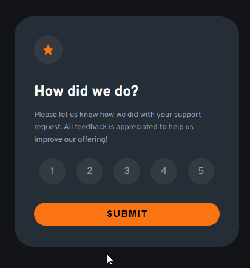

# Frontend Mentor - Interactive rating component solution

Esta é uma solução para o [Interactive rating component challenge on Frontend Mentor](https://www.frontendmentor.io/challenges/recipe-page-KiTsR8QQKm). Os desafios do Frontend Mentor ajudam você a melhorar suas habilidades de codificação construindo projetos realistas.
 

### Screenshot

[]

### Link


- URL do site ativo: [link aqui](https://andersonf-dev.github.io/interactive-rating-component-main/)

```js
// Seleciona os elementos necessários
const openModalButton = document.getElementById("openModal");
const modal = document.getElementById("modal");
const overlay = document.getElementById("modalOverlay");

// Função para abrir o modal
function openModal() {
  modal.classList.add("active");  // Mostra o modal
  overlay.classList.add("active");  // Mostra o overlay
  
  // Fecha o modal automaticamente após 5 segundos
  setTimeout(closeModal, 5000); // 5000 milissegundos = 5 segundos
}

// Função para fechar o modal
function closeModal() {
  modal.classList.remove("active");  // Esconde o modal
  overlay.classList.remove("active");  // Esconde o overlay
}

// Adiciona o evento de clique ao botão
openModalButton.addEventListener("click", openModal);
```

### Criado com

- Marcação HTML5 semântica
- Propriedades personalizadas CSS
- JavaScript


### O que aprendi

- Aprendi a criar uma card, posicionar elementos na tela centralizar, consutar o HTML atraves do DOM com JavaScript.
- Acesar uma lista e manipolar ela pelo JavaScript. 
- Adicionar e remover o ativo.
- Capiturar e exibir dado deacordo com o clik na lista e exibir o mesmo valor em outro lugar

### Desenvolvimento contínuo

Este é apenas mais um de muitos dos projetos de front end que fiz. Continuarei fazendo e me desenvolvendo ainda mais. Estou aprendendo cada dia mais, fazendo esses desafios, 